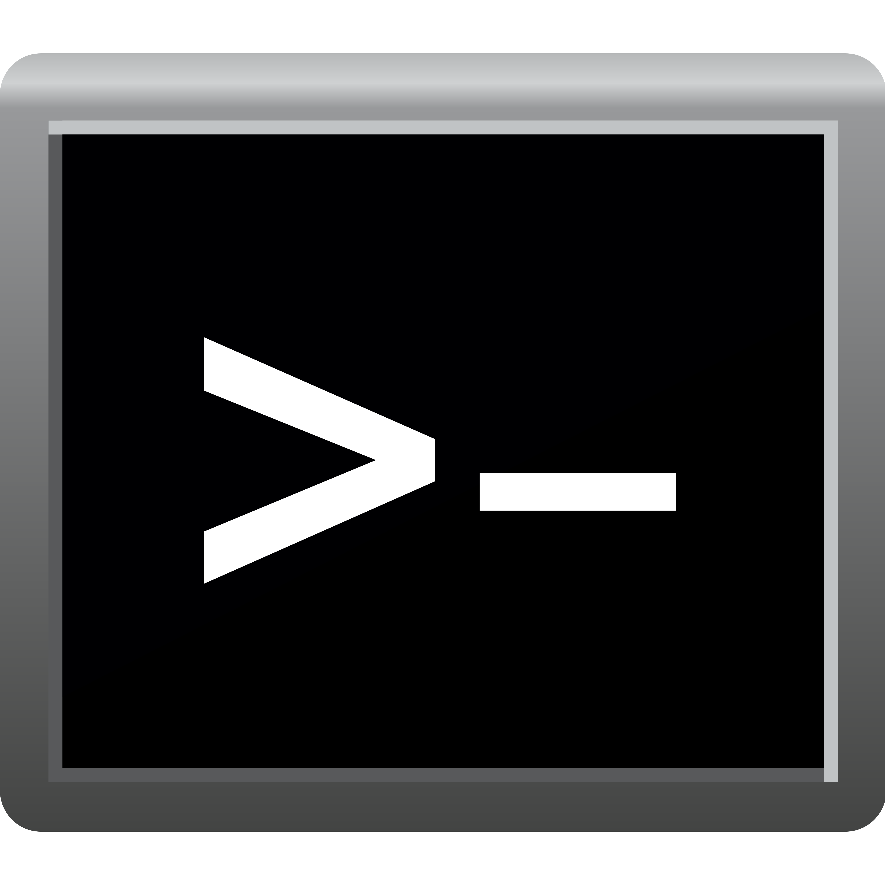

 **Do That**

# 💻 DoThat
An automation utility powered by scripts. For Windows machines only.

> DoThat is for educational usage only. Using scripts and this program on public machines for the purpose of destructive usage and illegal usage is not our fault. You're provided this software as-is with no warranty.

# ❓ How Does It Work?
DoThat works by scripts. DoThat has it's own scripting language called 'DoScript' or the (*.ds*) file-name. DoThat works by reading the script file line-by-line and detecting key-words that the interpreter can understand. And example script would be:

```
START NOTEPAD
WAIT 1500
SENDKEYS Hello, World!
```

This example script will start the 'Notepad' program, wait 1500 milliseconds, and finally, send a key-stroke consisting of "Hello, World!" to the active window. This happens to be the Notepad program. Please note that DoThat does not activate the administrator prompt or "UAC" / User Account Control. This means it works without administrator required. This also means you will not be able to perform administrative tasks.

# 🛠 Compiling DoThat
DoThat was coded in SharpDevelop. We know, we know, this IDE is very out-dated and discontinued, but Visual Studio is not my suited environment. I won't go into a rant, but it's requirement for a Microsoft account after 30 days is not my favorite feature.

DoThat can easily be converted to a Visual Studio project and may even open up without changes in Visual Studio. It mostly depends. You can easily read the existing source code though and fix it to work with Visual Studio.

To compile DoThat, download a copy of the code and verify it's contents. Open the Solution file (*.sln*) with the selected IDE you want and start surfing the code. If any problems occur, you can look into the other parts of the code. Most of the contents are stored in the "Parser.cs" file.

| Supported IDE's / Tools | Version | Support Status |
| --------------- | ------- | -------------- |
| SharpDevelop | 5.1.0 | ✔️ Supported Fully |
| Visual Studio | 2019-2022 | ⚠️ Semi-Supported |
| dnSpy Decompiler | Latest | ✔️ Supported Fully |

# 📜 License
DoThat is licensed under the MIT license. Feel free to use DoThat under it's license terms. DoThat does not come with **Liability** or **Warranty** so all the things you use DoThat for are under your terms and not the developers.

```
THE SOFTWARE IS PROVIDED "AS IS", WITHOUT WARRANTY OF ANY KIND, EXPRESS OR
IMPLIED, INCLUDING BUT NOT LIMITED TO THE WARRANTIES OF MERCHANTABILITY,
FITNESS FOR A PARTICULAR PURPOSE AND NONINFRINGEMENT. IN NO EVENT SHALL THE
AUTHORS OR COPYRIGHT HOLDERS BE LIABLE FOR ANY CLAIM, DAMAGES OR OTHER
LIABILITY, WHETHER IN AN ACTION OF CONTRACT, TORT OR OTHERWISE, ARISING FROM,
OUT OF OR IN CONNECTION WITH THE SOFTWARE OR THE USE OR OTHER DEALINGS IN THE
SOFTWARE.
```
